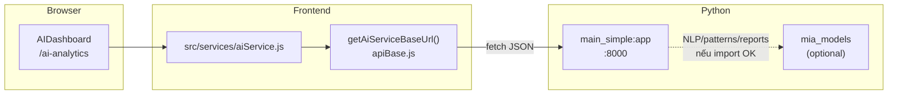

# Hướng dẫn AI Service (FastAPI) — Mia / React OAS Integration

Tài liệu **single source of truth** cho: kiến trúc, cổng, env, API, luồng từ UI → Python, và xử lý sự cố.

> **FAQ — sao có 8000 lẫn 8001?**
> **8000** = chỉ **AI Service** (FastAPI). **8001** = **Automation** (service khác, không phải AI). Hai process độc lập; doc cũ từng ghi nhầm AI = 8001.

---

## 1. Tóm tắt nhanh

| Thành phần               | Port mặc định | Vai trò                                                       |
| ------------------------ | ------------- | ------------------------------------------------------------- |
| **Frontend**             | 3000          | React, route AI: `/ai-analytics`                              |
| **Backend** (Node)       | 3001          | API chính, Sheets/Drive — **không** proxy AI trong flow chuẩn |
| **AI Service** (FastAPI) | 8000          | Phân tích / ML mock + optional `mia_models`                   |
| **Automation**           | 8001          | Khác hẳn AI — xem `docs/FLOW_AND_STRUCTURE.md`                |

Frontend gọi **trực tiếp** AI qua `REACT_APP_AI_SERVICE_URL` (mặc định `http://localhost:8000`), không đi qua Backend 3001.

---

## 2. Luồng hoạt động (end-to-end)



**Bước thực tế**

1. User mở **`http://localhost:3000/ai-analytics`** (menu AI Analytics).
2. `AIDashboard` gọi `aiService.analyzeData`, `getPredictions`, `getRecommendations`, v.v.
3. `aiService.js` build URL: `{REACT_APP_AI_SERVICE_URL}/api/...` và `fetch`.
4. `ai-service` xử lý (mock hoặc `mia_models` nếu cài đủ dependency).

---

## 3. Chạy AI Service (local)

### Cách 1 — cùng `npm run dev` (khuyến nghị)

`package.json` đã gộp: frontend + backend + ai-service.

```bash
# Root repo, đã có .venv (script activate trước khi chạy uvicorn)
npm run dev
```

Script AI (rút gọn): `source .venv/bin/activate && cd ai-service && python -m uvicorn main_simple:app --host 0.0.0.0 --port 8000 --reload`

### Cách 2 — chỉ AI

```bash
cd ai-service
python3 -m venv .venv
source .venv/bin/activate   # Windows: .venv\Scripts\activate
pip install -r requirements.txt
python -m uvicorn main_simple:app --host 0.0.0.0 --port 8000 --reload
```

### Kiểm tra nhanh

```bash
curl -s http://localhost:8000/health | jq .
curl -s http://localhost:8000/api/ml/insights | jq .
open http://localhost:8000/docs   # Swagger UI
```

---

## 4. Biến môi trường (Frontend)

Định nghĩa trong `src/utils/apiBase.js`:

| Biến                                  | Ý nghĩa                        |
| ------------------------------------- | ------------------------------ |
| `REACT_APP_AI_SERVICE_URL`            | Base URL AI (ưu tiên cao nhất) |
| `REACT_APP_AI_URL`                    | Alias                          |
| `VITE_AI_SERVICE_URL` / `VITE_AI_URL` | Dùng nếu build Vite            |

**Production (Vercel):** trỏ tới URL public của AI (nếu deploy riêng), ví dụ `https://your-ai.railway.app`. Nếu **không** deploy AI, dashboard vẫn mở được nhưng block AI sẽ lỗi / fallback — đây là thiết kế _optional service_.

**File mẫu:** xem `Document/ENV_PRODUCTION_REFERENCE.md` và `.env.example`.

---

## 5. API AI — mapping Frontend ↔ FastAPI

Entry **chuẩn** hiện tại: **`main_simple:app`** (không phải `ai_service.py` — file đó là bản demo/legacy khác tập endpoint).

### Các route mà `src/services/aiService.js` đang dùng

| Frontend method        | Method + path                                    | Ghi chú                                             |
| ---------------------- | ------------------------------------------------ | --------------------------------------------------- |
| `analyzeData`          | `POST /api/analyze`                              | Mock phân tích, trả `prediction`, `recommendations` |
| `getPredictions`       | `POST /api/ml/predict`                           | Body: `timeframe`, `metrics[]`                      |
| `getRecommendations`   | `GET /api/ml/insights` + `POST /api/ml/optimize` | Gộp khuyến nghị                                     |
| `detectAnomalies`      | `POST /api/ml/legacy/patterns/anomalies`         | Cần **mia_models**                                  |
| `chat`                 | `POST /api/ml/legacy/nlp/parse`                  | Cần **mia_models**                                  |
| `analyzeSheets`        | `POST /api/ml/legacy/nlp/summary`                | Cần **mia_models**                                  |
| `optimizeSystem`       | `POST /api/ml/optimize`                          | Giống optimize trong recommendations                |
| `analyzeGoogleContext` | `POST /api/ml/context/analyze`                   | Dữ liệu thật: grid Sheets + Drive (ONE automation)  |

Luồng chi tiết: [AI_AUTOMATION_SHEETS_PIPELINE.md](AI_AUTOMATION_SHEETS_PIPELINE.md).

### Endpoint bổ sung (test / debug)

- `GET /` — metadata service
- `GET /health` — `mia_models: true/false`
- `GET /api/status` — feature list
- `GET /api/ml/legacy/status` — chi tiết legacy modules

Swagger: **`/docs`**, OpenAPI JSON: **`/openapi.json`**.

---

## 6. Module `mia_models` (tùy chọn)

- Import trong `main_simple.py`; nếu lỗi → log warning, service vẫn chạy.
- Khi không có: các route `/api/ml/legacy/*` trả **503** với message rõ ràng.
- Cài dependency đầy đủ: xem **`ai-service/mia_models/README.md`** và `requirements.txt`.

**Health:** `GET /health` có field `mia_models: true` khi load thành công.

---

## 7. Giao diện người dùng

| Route           | Component     | File                                |
| --------------- | ------------- | ----------------------------------- |
| `/ai-analytics` | `AIDashboard` | `src/components/ai/AIDashboard.jsx` |

Menu: `src/components/layout/navigationData.js` → item AI Analytics.

---

## 8. Khắc phục sự cố

| Hiện tượng              | Hướng xử lý                                                                                                                 |
| ----------------------- | --------------------------------------------------------------------------------------------------------------------------- |
| `ECONNREFUSED` :8000    | Chạy `npm run ai-service` hoặc `npm run dev`; kiểm tra `lsof -i :8000`                                                      |
| Lỗi _HTML thay vì JSON_ | Sai base URL (trỏ nhầm vào CRA dev server). Đặt lại `REACT_APP_AI_SERVICE_URL=http://localhost:8000` và restart `npm start` |
| CORS                    | `main_simple` đã `allow_origins=["*"]` — nếu vẫn lỗi, kiểm tra proxy / mixed content (HTTPS site gọi HTTP local)            |
| Chat/NLP 503            | Chưa cài `mia_models` — chỉ dùng `/api/analyze`, `/api/ml/predict`, `/api/ml/insights` hoặc cài đủ deps                     |
| Test optional skip      | `node scripts/tests/frontend_connection_test.js` — AI là **optional**; 2 check bắt buộc là Backend                          |

---

## 9. Nâng cấp / mở rộng (TODO gợi ý)

1. **Model thật:** thay phần random trong `ml_predict` / `analyze` bằng pipeline sklearn đã train (template trong `mia_models/sklearn_templates/`).
2. **Proxy qua Backend:** nếu muốn một domain + auth tập trung — thêm reverse proxy Express → `8000` (hiện chưa có trong repo).
3. **Deploy AI:** Docker image `ai-service`, biến `AI_SERVICE_PORT`, health check `/health`.

---

## 10. Tài liệu liên quan

- `docs/FLOW_AND_STRUCTURE.md` — luồng tổng (FE / BE / AI / Automation)
- `ai-service/mia_models/README.md` — NLP, patterns, reports
- `ai-service/OPTIMIZATION_INTEGRATION.md` — COBYQA / optimization
- `src/services/aiService.js` — contract thực tế phía React

---

**Phiên bản tài liệu:** 1.0 · **Entry FastAPI:** `main_simple:app` · **Port chuẩn:** `8000`
