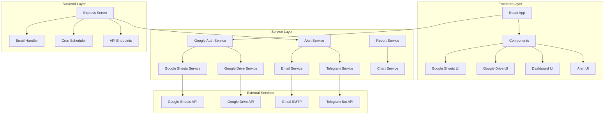
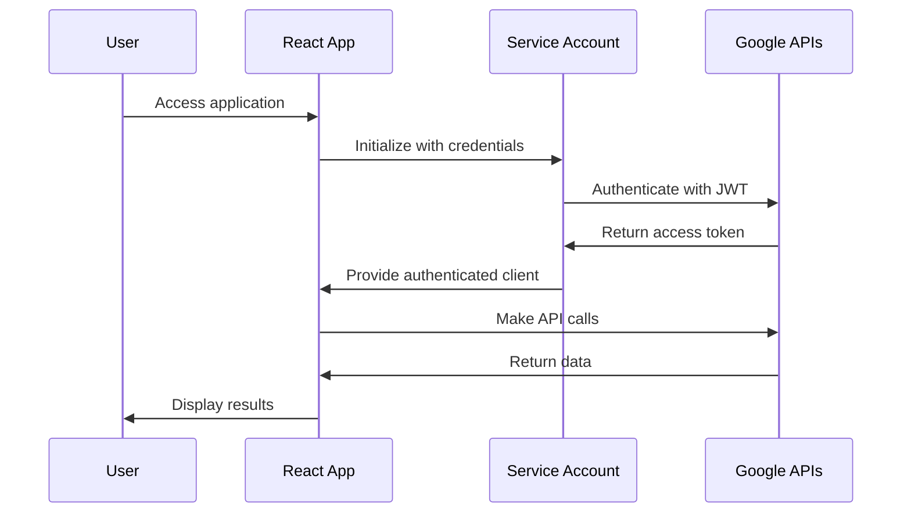
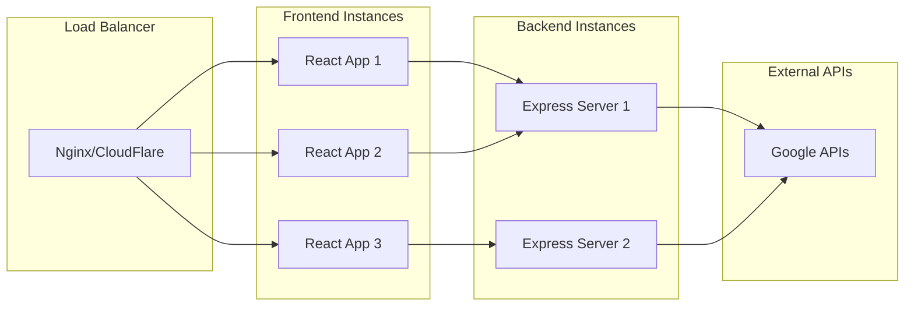
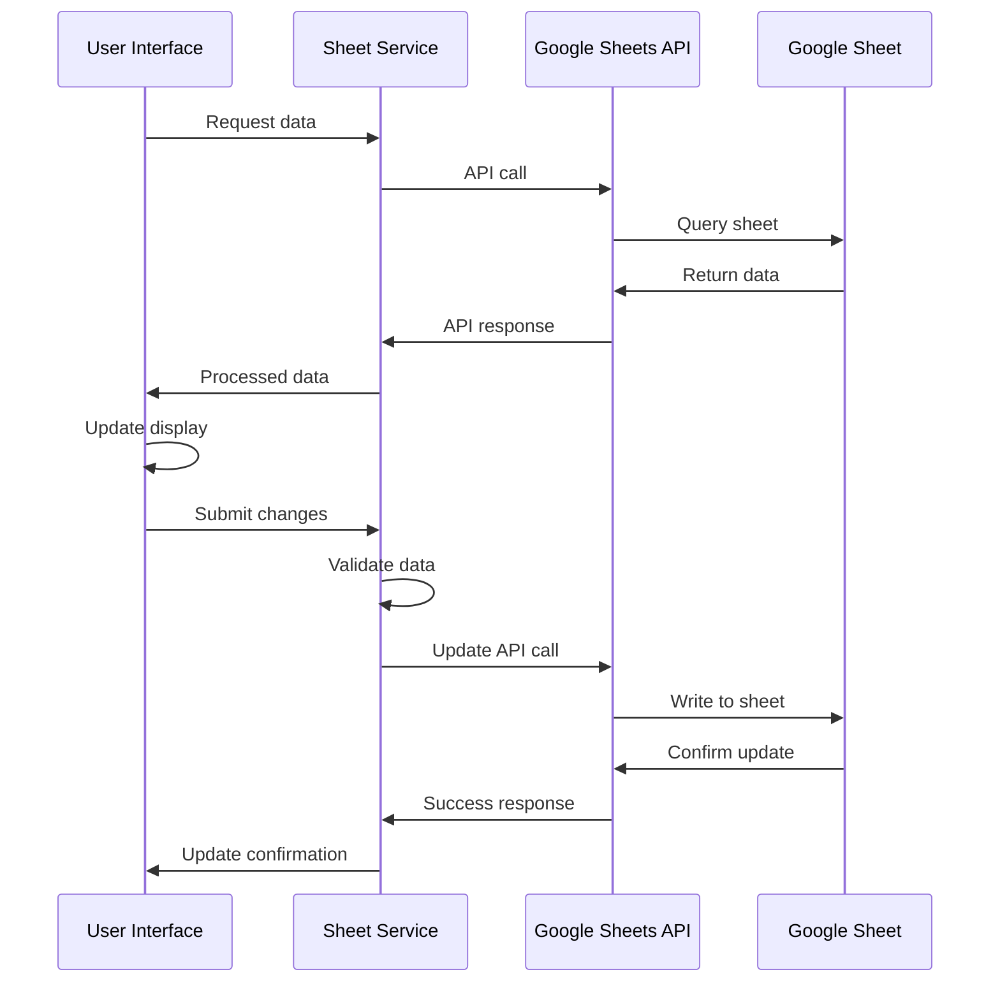
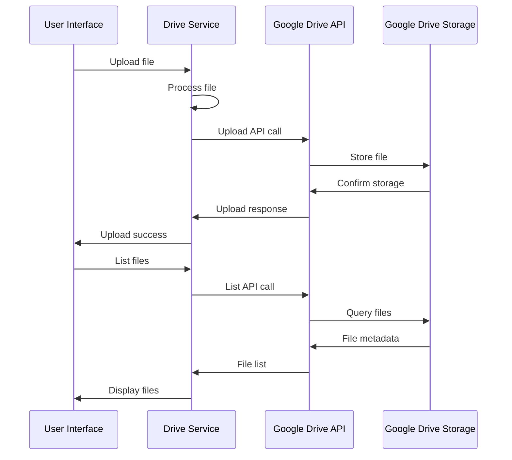
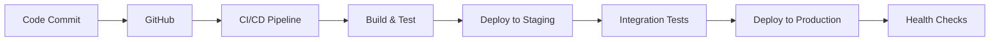

# 🏗️ KIẾN TRÚC HỆ THỐNG REACT GOOGLE INTEGRATION

## 📊 Tổng quan kiến trúc



## 🎯 Kiến trúc phân lớp

### 1. **Presentation Layer (Frontend)**

- **React Components**: UI components tương tác với người dùng
- **State Management**: React hooks và context
- **Routing**: React Router (nếu cần)
- **Styling**: CSS3 với responsive design

### 2. **Service Layer (Business Logic)**

- **Google Services**: Xử lý kết nối và thao tác với Google APIs
- **Alert Services**: Quản lý hệ thống cảnh báo
- **Report Services**: Tạo và xử lý báo cáo
- **Data Services**: Xử lý dữ liệu và validation

### 3. **Integration Layer (APIs)**

- **Google Sheets API**: Đọc/ghi dữ liệu spreadsheet
- **Google Drive API**: Upload/download files
- **Email API**: Gửi email thông báo
- **Telegram API**: Gửi tin nhắn instant

### 4. **Data Layer**

- **Google Sheets**: Lưu trữ dữ liệu chính
- **Google Drive**: Lưu trữ files và báo cáo
- **Local Storage**: Cache và session data

## 🔧 Component Architecture

### Frontend Components Structure

```
src/
├── components/
│   ├── Common/                 # Shared components
│   │   ├── ErrorBoundary.js   # Error handling
│   │   ├── LoadingSpinner.js  # Loading states
│   │   └── Notification.js    # Toast notifications
│   ├── GoogleSheet/           # Google Sheets components
│   │   ├── SheetManager.js    # Main sheet manager
│   │   ├── SheetReader.js     # Read operations
│   │   ├── SheetWriter.js     # Write operations
│   │   └── SheetTester.js     # Testing component
│   ├── GoogleDrive/           # Google Drive components
│   │   ├── DriveManager.js    # Main drive manager
│   │   ├── DriveUploader.js   # File upload
│   │   ├── FileViewer.js      # File display
│   │   └── DriveTester.js     # Testing component
│   ├── Dashboard/             # Dashboard components
│   │   ├── DemoDashboard.js   # Demo dashboard
│   │   └── TestDashboard.js   # Test dashboard
│   └── Alerts/                # Alert components
│       ├── AlertManager.js    # Alert management
│       └── AlertTester.js     # Alert testing
```

### Service Layer Structure

```
src/
├── services/
│   ├── googleAuth.js          # Google authentication
│   ├── googleSheets.js        # Sheets operations
│   ├── googleDrive.js         # Drive operations
│   ├── alertService.js        # Alert system
│   └── reportService.js       # Report generation
├── hooks/
│   ├── useGoogleSheets.js     # Sheets custom hook
│   └── useGoogleDrive.js      # Drive custom hook
├── config/
│   └── googleConfig.js        # Google API configuration
└── utils/
    ├── dateUtils.js           # Date utilities
    ├── fileUtils.js           # File utilities
    └── validators.js          # Data validation
```

## 🔐 Security Architecture

### Authentication Flow



### Security Measures

1. **Service Account Authentication**
   - JWT-based authentication
   - Scoped permissions
   - Secure credential storage

2. **Environment Variables**
   - Sensitive data in .env files
   - Not committed to version control
   - Different configs per environment

3. **API Security**
   - Rate limiting
   - Input validation
   - Error message sanitization

4. **Data Protection**
   - HTTPS only in production
   - Secure file uploads
   - Data validation

## 📈 Scalability Architecture

### Horizontal Scaling Strategy



### Performance Optimization

1. **Frontend Optimization**
   - Code splitting
   - Lazy loading
   - Bundle optimization
   - Caching strategies

2. **API Optimization**
   - Batch operations
   - Request caching
   - Rate limiting
   - Connection pooling

3. **Data Optimization**
   - Pagination
   - Data compression
   - Efficient queries
   - Background processing

## 🔄 Data Flow Architecture

### Google Sheets Data Flow



### Google Drive Data Flow



## 🚀 Deployment Architecture

### Development Environment

```
Developer Machine
├── React Development Server (Port 3000)
├── Express Backend Server (Port 3001)
├── Environment Variables (.env)
└── Google Service Account Key
```

### Production Environment

```
Cloud Platform (Netlify/Vercel/AWS)
├── Frontend (Static Hosting)
├── Backend (Serverless Functions)
├── Environment Variables (Secure)
└── Google Service Account (Secure)
```

### CI/CD Pipeline



## 📊 Monitoring Architecture

### Application Monitoring

1. **Performance Monitoring**
   - Page load times
   - API response times
   - Error rates
   - User interactions

2. **Error Tracking**
   - JavaScript errors
   - API failures
   - Network issues
   - User feedback

3. **Business Metrics**
   - User engagement
   - Feature usage
   - Data processing volumes
   - System uptime

### Logging Strategy

```javascript
// Structured logging example
{
  "timestamp": "2024-01-15T10:30:00Z",
  "level": "info",
  "service": "google-sheets",
  "operation": "read-sheet",
  "duration": 250,
  "status": "success",
  "metadata": {
    "sheetId": "1BxiMVs0XRA5nFMdKvBdBZjgmUUqptlbs74OgvE2upms",
    "range": "A1:D10",
    "rows": 10
  }
}
```

## 🔧 Technology Stack

### Frontend Technologies

- **React 18**: UI framework
- **JavaScript ES6+**: Programming language
- **CSS3**: Styling and responsive design
- **Chart.js**: Data visualization
- **Axios**: HTTP client

### Backend Technologies

- **Node.js**: Runtime environment
- **Express.js**: Web framework
- **Nodemailer**: Email service
- **Node-cron**: Task scheduling

### Google APIs

- **Google Sheets API v4**: Spreadsheet operations
- **Google Drive API v3**: File management
- **Google Auth Library**: Authentication

### Development Tools

- **Create React App**: Build tooling
- **Git**: Version control
- **npm**: Package management
- **ESLint**: Code linting

### Deployment Platforms

- **Netlify/Vercel**: Frontend hosting
- **AWS Lambda**: Serverless backend
- **Google Cloud**: API services

## 🎯 Best Practices

### Code Organization

1. **Separation of Concerns**: Clear separation between UI, business logic, and data
2. **Reusable Components**: Modular and reusable UI components
3. **Service Layer**: Centralized business logic in services
4. **Error Handling**: Comprehensive error handling and user feedback

### Performance

1. **Lazy Loading**: Load components and data on demand
2. **Caching**: Implement appropriate caching strategies
3. **Batch Operations**: Group API calls for efficiency
4. **Optimization**: Regular performance monitoring and optimization

### Security

1. **Environment Variables**: Secure storage of sensitive data
2. **Input Validation**: Validate all user inputs
3. **Error Sanitization**: Don't expose sensitive information in errors
4. **HTTPS**: Use secure connections in production

### Maintainability

1. **Documentation**: Comprehensive code and API documentation
2. **Testing**: Unit, integration, and end-to-end tests
3. **Code Standards**: Consistent coding standards and linting
4. **Version Control**: Proper Git workflow and branching strategy

---

**Kiến trúc này được thiết kế để:**

- ✅ Dễ dàng mở rộng và bảo trì
- ✅ Hiệu suất cao và tối ưu
- ✅ Bảo mật và tin cậy
- ✅ Phù hợp với quy mô từ nhỏ đến lớn
